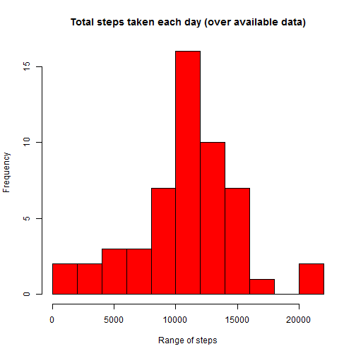
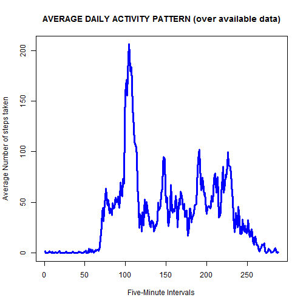
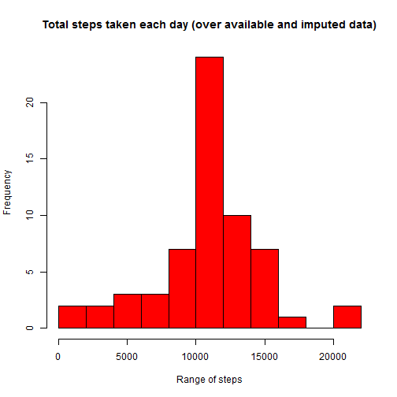
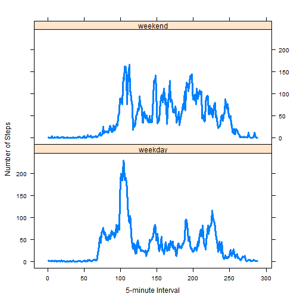

REPRODUCIBLE RESEARCH - PROJECT 1
=================================

## INTRODUCTION

### This study makes use of data from a personal activity monitoring device. This device collects data at 5 minute intervals through out the day. The data consists of two months of data from an anonymous individual collected during the months of October and November, 2012 and include the number of steps taken in 5 minute intervals each day.

## The variables included in this dataset are:

steps: Number of steps taking in a 5-minute interval (missing values are coded as NA)

date: The date on which the measurement was taken in YYYY-MM-DD format

interval: Identifier for the 5-minute interval in which measurement was taken

### The dataset is stored in a comma-separated-value (CSV) file and there are a total of 17,568 observations in this dataset.

### Data use for this study can be fown here
https://github.com/pascal082/RepData_PeerAssessment1/blob/master/activity.zip

Loading and preprocessing the data
Load and read data:


```r
library(ggplot2)
```

```
## Warning: package 'ggplot2' was built under R version 3.2.3
```

```r
library(dplyr)
```

```
## Warning: package 'dplyr' was built under R version 3.2.3
```

```
## 
## Attaching package: 'dplyr'
## 
## The following objects are masked from 'package:stats':
## 
##     filter, lag
## 
## The following objects are masked from 'package:base':
## 
##     intersect, setdiff, setequal, union
```


```r
library(lattice)
fileUrl<-"https://d396qusza40orc.cloudfront.net/repdata%2Fdata%2Factivity.zip"

download.file(fileUrl, destfile='./activity.zip',method='auto')
unzip('./activity.zip', exdir='./files')
data <- read.csv("./files/activity.csv", header = TRUE, colClasses = c("numeric", "character","integer"))
data_wholes<-data[complete.cases(data),]
```

### What is the mean total number of steps taken per day?


```r
datas<-aggregate(steps~date,data=data_wholes,sum)
average<-mean(datas$steps) 
mediana<-median(datas$steps)
summary(datas)
```

```
##      date               steps      
##  Length:53          Min.   :   41  
##  Class :character   1st Qu.: 8841  
##  Mode  :character   Median :10765  
##                     Mean   :10766  
##                     3rd Qu.:13294  
##                     Max.   :21194
```

#### Calculate the total number of steps taken per day: 53
#### mean:

```r
average
```

```
## [1] 10766.19
```

#### meadian:

```r
mediana
```

```
## [1] 10765
```

#### histogram of the total number of steps taken each day


```r
hist(datas$steps, main = "Total steps taken each day (over available data)", xlab = "Range of steps", col = "red", breaks=pretty(0:22000, n=10))
```

 

###data manipulation

```r
data_by_5_mins<-group_by(data_wholes,interval)
average_by_interval<-summarize(data_by_5_mins,avg=mean(steps))
names(average_by_interval)<-c("interval","average_steps")
top_index<-which.max(average_by_interval$average_steps)
top_interval<-average_by_interval[top_index,"interval"]
max_avg_steps<-average_by_interval[top_index,"average_steps"]
```

### What is the average daily activity pattern?


#### a time series plot (i.e. type = "l") of the 5-minute interval (x-axis) and the average number of steps taken, averaged across all days (y-axis)

```r
plot(x=1:288,y=average_by_interval$average_steps,type="l", xlab="Five-Minute Intervals", ylab="Average Number of steps taken", main="AVERAGE DAILY ACTIVITY PATTERN (over available data)",lwd=3,col="blue")
```

 


### Which 5-minute interval, on average across all the days in the dataset, contains the maximum number of steps?

On average, the maximum number of steps occurs in the interval whose ordinal number, among all 288 5-minute intervals, is 104.Its value in the dataset is 835,


### Imputing missing values

#### Note that there are a number of days/intervals where there are missing values (coded as NA). The presence of missing days may introduce bias into some calculations or summaries of the data.

#### Calculate and report the total number of missing values in the dataset (i.e. the total number of rows with NAs)


```r
NaDataSet<-data[!complete.cases(data),]
totMissingValues<-length(NaDataSet[,1])
```
#### total nunber of missing values

```r
totMissingValues
```

```
## [1] 2304
```
#### I substituted the NA's with the mean value for their corresponding 5-minute interval.


```r
NaDataSet[,"steps"]<-average_by_interval[,"average_steps"]
data[!complete.cases(data),"steps"]<-NaDataSet[,"steps"]
```

#### new dataset that is equal to the original dataset but with the missing data filled in

```r
newDatas<-aggregate(steps~date,data=data,sum)
```

#### histogram of the total number of steps taken each day and Calculate and report the mean and median total number of steps taken per day

```r
hist(newDatas$steps, main = "Total steps taken each day (over available and imputed data)", xlab = "Range of steps", col = "red", breaks=pretty(0:22000, n=10))
```

 
#### new mean

```r
newAverage<-mean(newDatas$steps)
newAverage
```

```
## [1] 10766.19
```


###new median

```r
newMediana<-median(newDatas$steps)
newMediana
```

```
## [1] 10766.19
```
### The mean and median total number of steps taken per day are both the same as the mean total number of steps taken per day as measured by the originally available data above. The meadian is affected when the missing data is inputed.


### Are there differences in activity patterns between weekdays and weekends?

#### For this part the weekdays() function may be of some help here. We would Use the dataset with the filled-in missing values for this part.

#### Create a new factor variable in the dataset with two levels - "weekday" and "weekend" indicating whether a given date is a weekday or weekend day.
#### We would be separating the weekdays from weekends using the originally available dataset in the following code bellow.


```r
data$date<-as.Date(data$date)
data<-mutate(data,day="NA")
weekend<-weekdays(data$date)=="Saturday" | weekdays(data$date)=="Sunday"
data$day[weekend]<-"weekend"
data$day[!weekend]<-"weekday"
data2Feriale<-data[data$day=="weekday",]
data2Festivo<-data[data$day=="weekend",]
data2FerialeBis<-group_by(data2Feriale,interval)
data2FestivoBis<-group_by(data2Festivo,interval) 
medieFeriale<-mutate(data2FerialeBis,average=mean(steps))
medieFestivo<-mutate(data2FestivoBis,average=mean(steps))
medieBoth<-rbind(medieFeriale[1:288,],medieFestivo[1:288,])
medieBothBis<-cbind(medieBoth,c(1:288,1:288))
names(medieBothBis)<-c("steps","date","interval","day","average","ordinal_interval")
```

### A plot containing a time series of the 5-minute interval (x-axis) and the average number of steps take, averaged across all weekday days or weekend days (y-axis).


```r
xyplot(average~ordinal_interval|day,type="l",data=medieBothBis, xlab="5-minute Interval" ,ylab="Number of Steps",lwd=3,layout=c(1,2))
```

 


### The  code below calculates the 5-minute interval when motion is at its peak on weekday days.

```r
peak_time<-medieFeriale$interval[which.max(medieFeriale$average[1:288])]
```

### We can see that the motion, when measured in terms of steps taken, is more intense and better distributed on weekend days that on weekday days.
